# Projeto de Interface

Pré-requisitos: <a href="2-Especificação do Projeto.md"> Documentação de Especificação</a>

Visão geral da interação do usuário pelas telas do sistema e protótipo interativo das telas com as funcionalidades que fazem parte do sistema (wireframes).

 Apresente as principais interfaces da plataforma. Discuta como ela foi elaborada de forma a atender os requisitos funcionais, não funcionais e histórias de usuário abordados nas <a href="2-Especificação do Projeto.md"> Documentação de Especificação</a>.

## Diagrama de Fluxo

## Wireframes

Link do wireframe: https://www.figma.com/proto/1pKglCPNoUg7BC2DBvNsl4/Sem-t%C3%ADtulo?node-id=36-6&p=f&t=pcS5S6RAzpvOvXZW-1&scaling=min-zoom&content-scaling=fixed&page-id=0%3A1

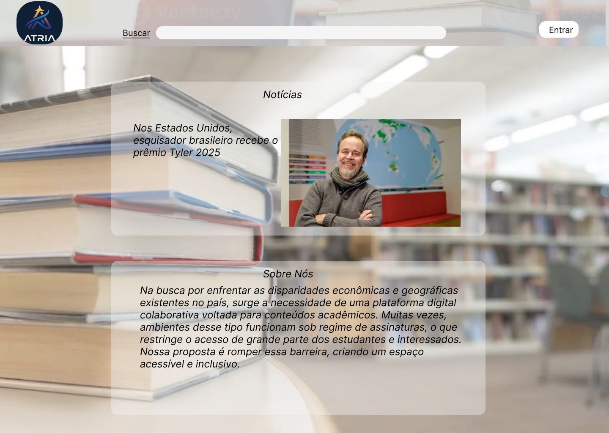
Tela de apresentação inicial da aplicação

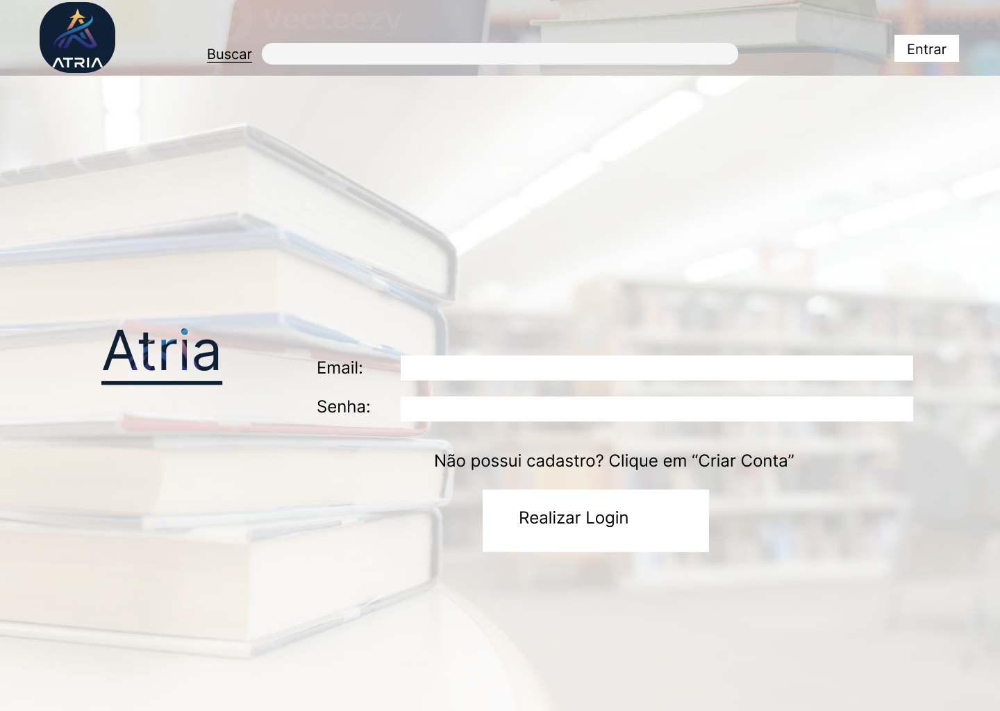

Permite a realização de Login na plataforma(RF-002)

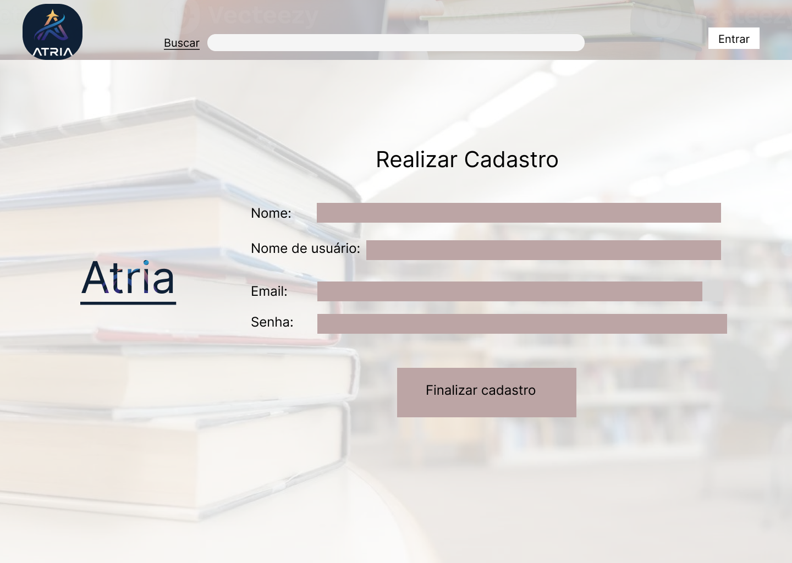
Essa tela permite a realização de um cadastro de usuário (RF-001)

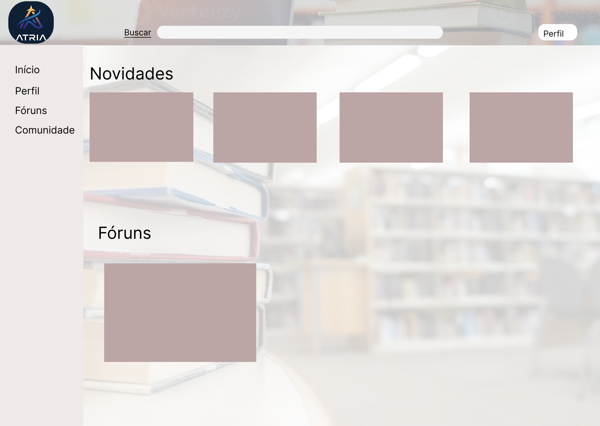
Após a realização do login, o usário será direcionado para esta tela

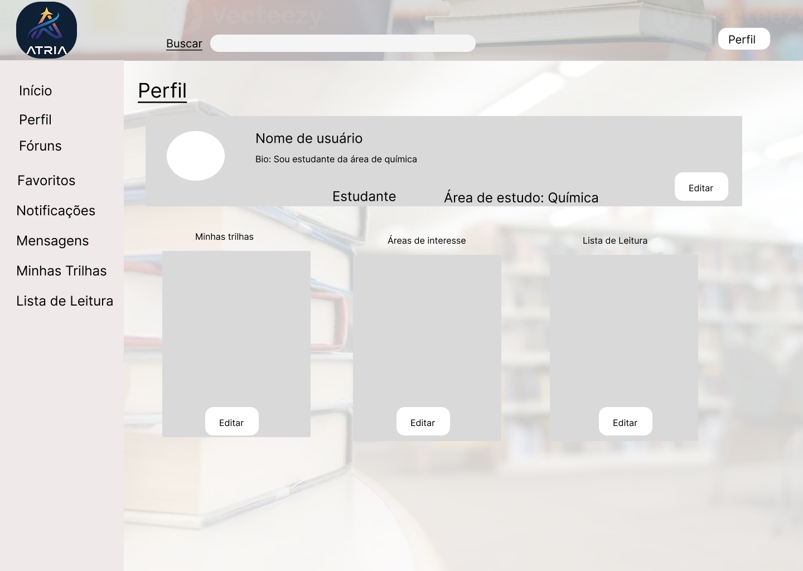
Permite que o usuário edite o seu perfil (RF-011), criando Trilhas de Conhecimento(RF-019) e listas de Leitura (RF-017) e compartilhe (RF-010)

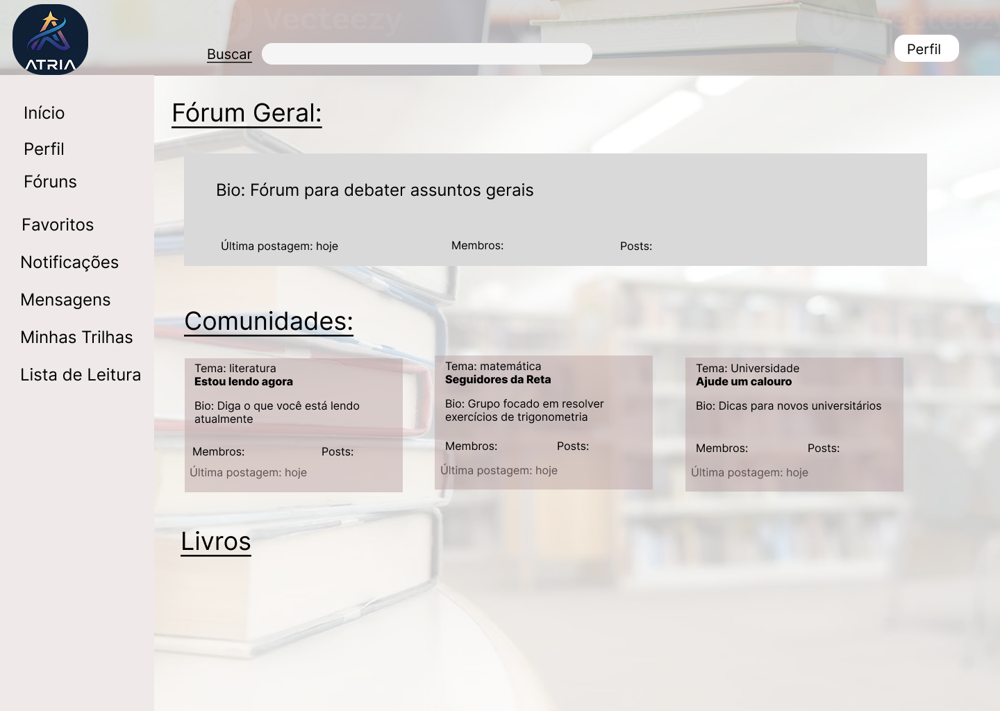
Tela de demostração de exibição do Fórum Geral do site

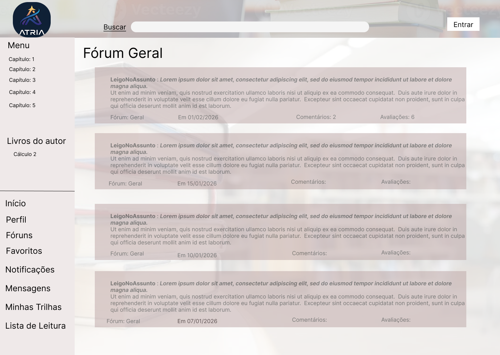
Tela que permitirá a visualização das discussões no Fórum Geral e criação de tópicos no fórum (RF-016)

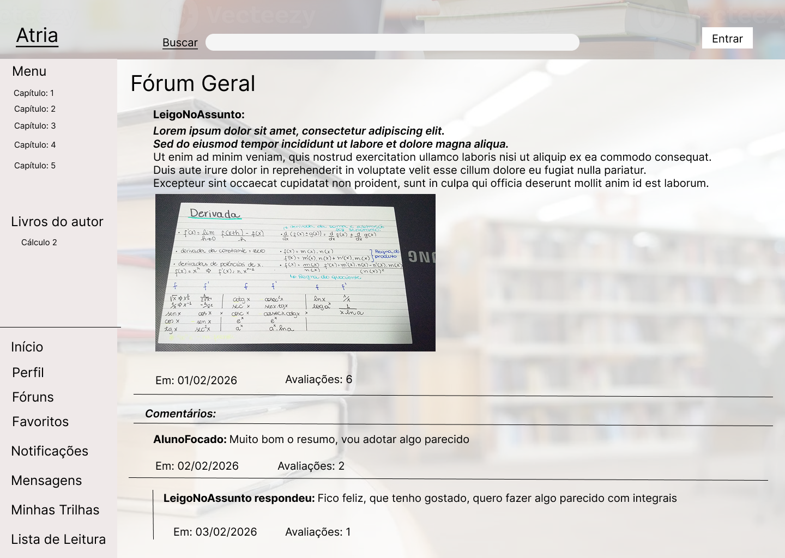
Exemplo de post em fórum. Posts em outras categorias seguirão o mesmo modelo.

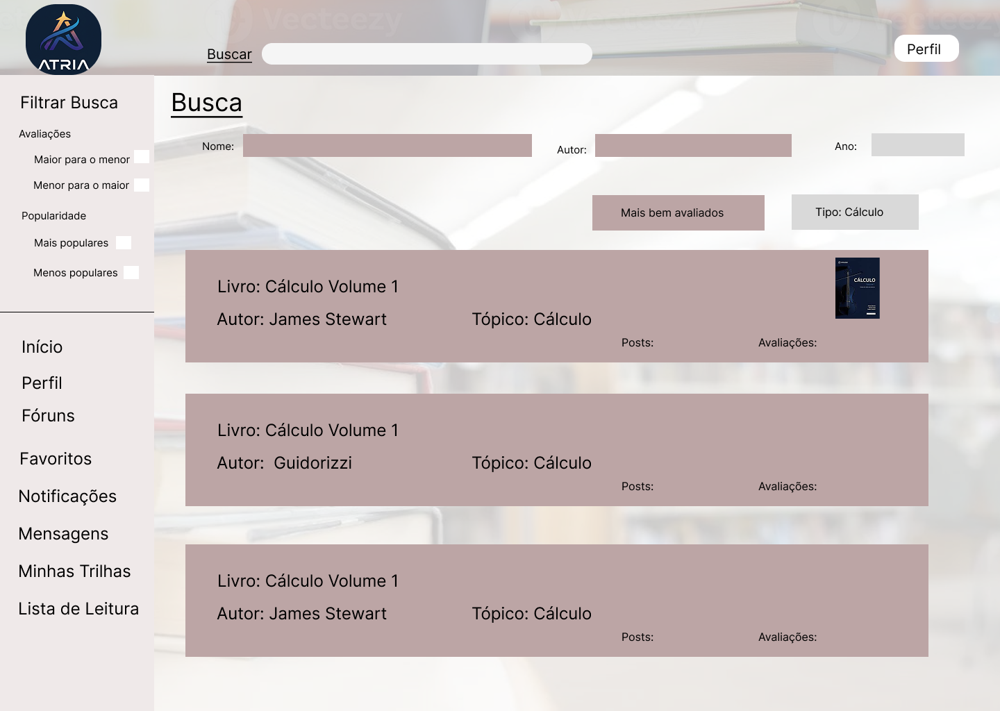
Permite o usuário realize buscas avançadas (RF-003) e materias de mais bem avaliados (RF-018) e mais populares (RF-009)

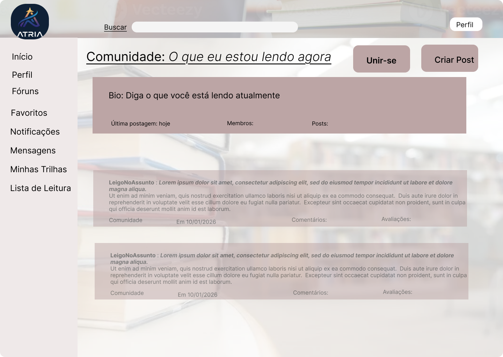

Tela que permite visualização e, nós ícones no canto direito, criação de comunidade e juntar-se à comunidade (RF-005) (RF-012) .

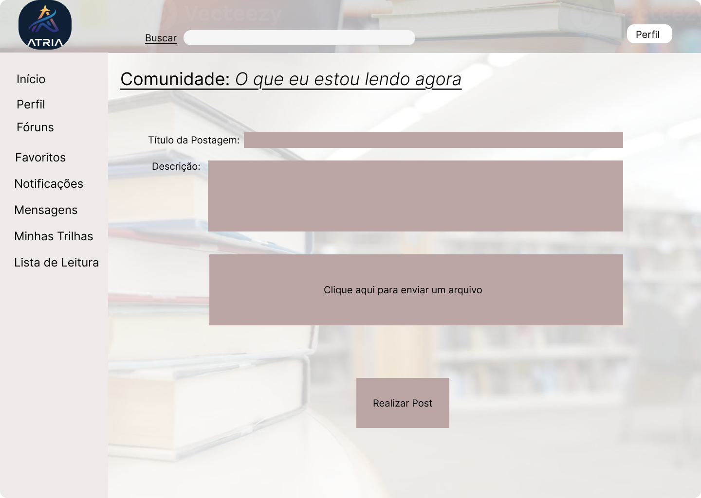

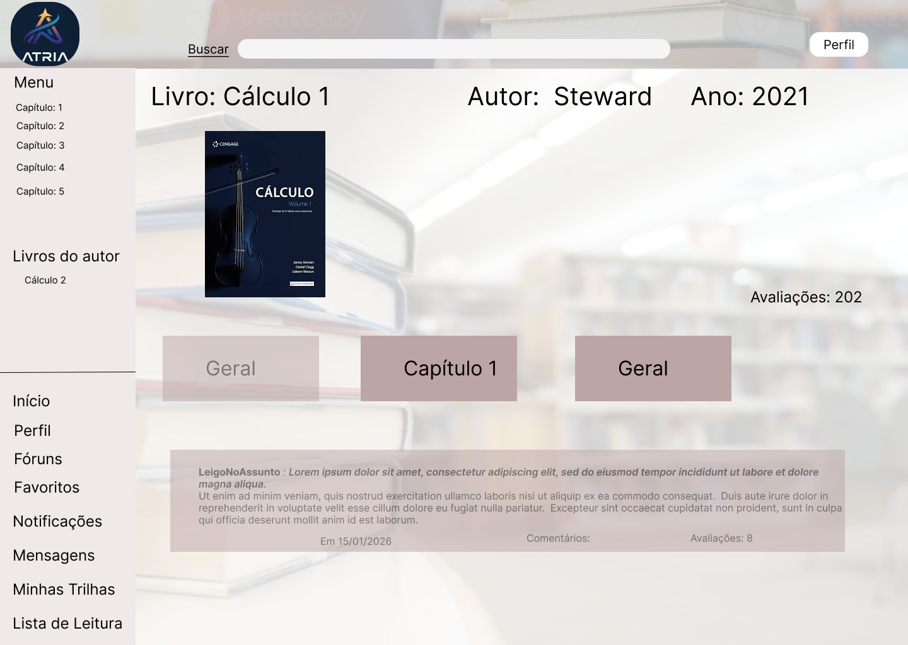
Após clicar em uma das opções de busca do livro, o usuário será direcionado para esta tela

