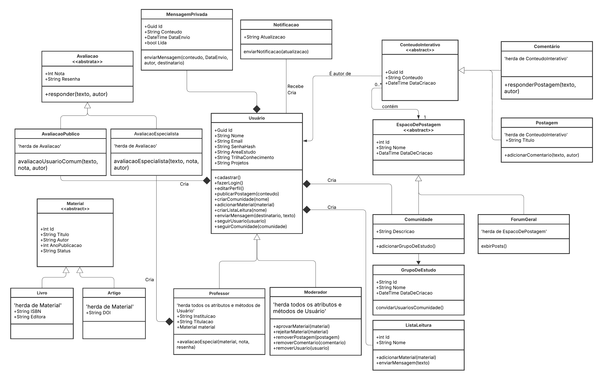
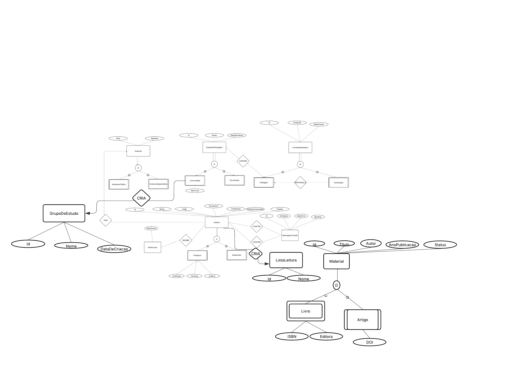

# Arquitetura da Solução

Pré-requisitos: <a href="3-Projeto de Interface.md"> Projeto de Interface</a>

Definição de como o software é estruturado em termos dos componentes que fazem parte da solução e do ambiente de hospedagem da aplicação.

## Diagrama de Classes
A seguir, apresentamos o Diagrama de Classes UML do projeto. Ele representa a estrutura central do nosso backend, detalhando as principais entidades, seus atributos, métodos e os relacionamentos que governam a lógica de negócio. Este modelo serve como o blueprint para a construção do banco de dados e o desenvolvimento das classes em C#.

## Modelo ER (Projeto Conceitual)

# Projeto de Base de Dados 

Este repositório contém o **Projeto da Base de Dados (Nível Físico)** para a aplicação [Seu Projeto/Sistema]. O projeto traduz o Modelo ER e o Diagrama de Classes UML em uma estrutura de base de dados relacional, incluindo tabelas, colunas, tipos de dados e restrições de integridade.

O código DDL (Data Definition Language) para a criação do esquema está disponível na pasta `ddl/`.

## 1. Convenções Adotadas

| Elemento | Definição | Exemplo |
| :--- | :--- | :--- |
| **Nomes** | Tabelas em `TB_` e colunas em **CAIXA ALTA**. | `TB_USUARIO`, `NOME` |
| **PK** | Chave Primária (Identificador único de cada registro). | `ID_USUARIO` |
| **FK** | Chave Estrangeira (Referência a uma PK de outra tabela). | `FK_APROVADOR` |
| **Tipos** | Padrões SQL comuns (`VARCHAR`, `INT`, `DATETIME`, `TEXT`, `BOOLEAN`). | `VARCHAR(100)` |
| **Integridade** | Aplicação de `UNIQUE` e `NOT NULL` onde necessário. | `EMAIL VARCHAR(150) UNIQUE NOT NULL` |

## 2. Resumo das Tabelas Principais

| Tabela | Chave Primária (PK) | Descrição |
| :--- | :--- | :--- |
| `TB_USUARIO` | `ID_USUARIO` | Armazena dados de cadastro, autenticação e perfil do usuário. |
| `TB_MATERIAL` | `ID_MATERIAL` | Documentos, artigos ou conteúdos de estudo. |
| `TB_AVALIACAO` | `ID_AVALIACAO` | Notas e tipos de avaliação para um material específico. |
| `TB_COMUNIDADE` | `ID_COMUNIDADE` | Fóruns ou grupos temáticos. |
| `TB_POSTAGEM` | `ID_POSTAGEM` | Posts criados pelos usuários (em fóruns ou postagens abertas). |
| `TB_GRUPO_ESTUDO` | `ID_GRUPO` | Grupos menores dentro de uma comunidade (ou gerais). |
| `TB_LISTA_LEITURA`| `ID_LISTA` | Listas de materiais criadas pelos usuários. |

## 3. Resumo das Tabelas de Relacionamento (N:M)

| Tabela | Chave Composta (PK) | Relacionamento Resolvido |
| :--- | :--- | :--- |
| `TB_USUARIO_COMUNIDADE` | `FK_USUARIO`, `FK_COMUNIDADE` | Usuário **participa/segue** Comunidade |
| `TB_LISTA_TEM_MATERIAL` | `FK_LISTA`, `FK_MATERIAL` | Material **fazParte** ListaLeitura |
| `TB_USUARIO_GRUPO` | `FK_USUARIO`, `FK_GRUPO` | Usuário **pertence** a GrupoEstudo |

## 4. Restrições Chave de Integridade

As seguintes regras de negócio são aplicadas no nível do banco de dados:

1.  **Avaliação Única por Usuário**: A combinação de (`FK_USUARIO`, `FK_MATERIAL`) na `TB_AVALIACAO` é definida como `UNIQUE`.
2.  **Identidade Única**: A coluna `EMAIL` na `TB_USUARIO` possui uma restrição `UNIQUE` e `NOT NULL`.
3.  **Postagens em Fóruns**: A coluna `FK_COMUNIDADE` na `TB_POSTAGEM` é `NULLABLE`. Se nula, o campo `NOFORUMGERAL` deve ser `TRUE` (permitindo postagens abertas).

